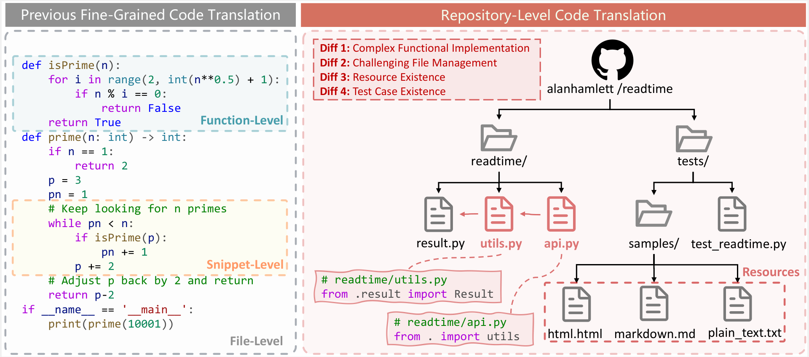
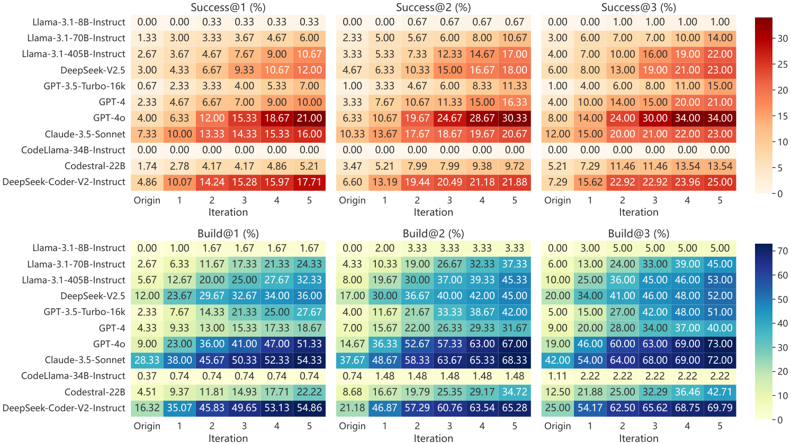

# 📂 RepoTransBench: A Real-World Benchmark for Repository-Level Code Translation

📄 Here, we anonymously provide the data, automation scripts, prompt templates, and experimental results of RepoTransBench.

> In this paper, we introduce a real-world benchmark for repository-level code translation. 

**📦 Repository Dataset:** Download the repository dataset from [RepositoryDataset](https://drive.google.com/file/d/1-BwolLb8MY0dLJnBhYQakTv6lmA8qSLh/view?usp=sharing) and use the command `tar -zxvf python_repos.tar.gz` to extract the dataset to the `./repos` directory.

**🔬 Experimental Results:** Download the experimental results from [ExperimentalResults](https://drive.google.com/file/d/1muVM3cWMceJqRo1FJQQDmvhzqY_vFHq6/view?usp=sharing) and use the command `tar -zxvf experiment_results.tar.gz` to extract the result files.

**🔧 Research Questions:** The research questions results and corresponding scripts are available at the `./RQ` directory.


---

### Translation Level


<!--  -->
<!--  -->
<!--  -->


### Translation Performance

| **Model**                       | **Success@1** | **Success@2** | **Success@3** | **Build@1** | **Build@2** | **Build@3** | **APR**   |
| :------------------------------ | :-----------: | :-----------: | :-----------: | :---------: | :---------: | :---------: | :-------: |
| Llama-3.1-8B-Inst               |     0.00%     |     0.00%     |     0.00%     |   0.00%     |   0.00%     |   0.00%     |   0.00%   |
| Llama-3.1-70B-Inst              |     1.33%     |     2.33%     |     3.00%     |   2.67%     |   4.33%     |   6.00%     |   1.30%   |
| Llama-3.1-405B-Inst             |     2.67%     |     3.33%     |     4.00%     |   5.67%     |   8.00%     |  10.00%     |   4.70%   |
| DeepSeek-V2.5                   |     3.00%     |     4.67%     |     6.00%     |  12.00%     |  17.00%     |  20.00%     |   6.20%   |
| GPT-3.5-Turbo                   |     0.67%     |     1.00%     |     1.00%     |   2.33%     |   4.00%     |   5.00%     |   1.10%   |
| GPT-4                           |     2.33%     |     3.33%     |     4.00%     |   4.33%     |   7.00%     |   9.00%     |   2.00%   |
| GPT-4o                          |     4.00%     |     6.33%     |     8.00%     |   9.00%     |  14.67%     |  19.00%     |   6.40%   |
| Claude-3.5-Sonnet               |     7.33%     |    10.33%     |    12.00%     |  28.33%     |  37.67%     |  42.00%     |  16.50%   |
| CodeLlama-34B-Inst              |     0.00%     |     0.00%     |     0.00%     |   0.37%     |   0.67%     |   1.00%     |   0.00%   |
| Codestral-22B                   |     2.08%     |     3.33%     |     5.00%     |   5.90%     |   8.33%     |  12.00%     |   2.60%   |
| DeepSeek-Coder-V2-Inst          |     4.86%     |     6.33%     |     7.00%     |  16.84%     |  20.33%     |  24.00%     |   8.40%   |

### Debugging Performance


<!--  -->
<!--  -->
<!--  -->

---

**⚠️ If you want to obtain the results from scratch, please follow these steps:**

**🛠️ Set-Up:** Download the docker container from [Docker4RepoTransBench](https://drive.google.com/file/d/1q4LpOMn-XQfMXrU0GxsJItZNQ6shuGTr/view?usp=sharing) and load it to construct your docker environment.


## 🚀 Evaluation

The evaluation command is as follows, we provide examples for GPT-4o:

```bash
# Translation and debugging
python main.py \
    --enable_translate \
    --model_name 'GPT-4o' \
    --enable_debug \
    --debug_mode 'filter' \
```

```bash
# Translation only
python main.py \
    --enable_translate \
    --model_name 'GPT-4o'
```

```bash
# Debugging only
python main.py \
    --model_name 'GPT-4o' \
    --enable_history '' \ 
    --history_time '' \  # History time of translation results
    --enable_debug \
    --debug_mode 'filter' \
```
